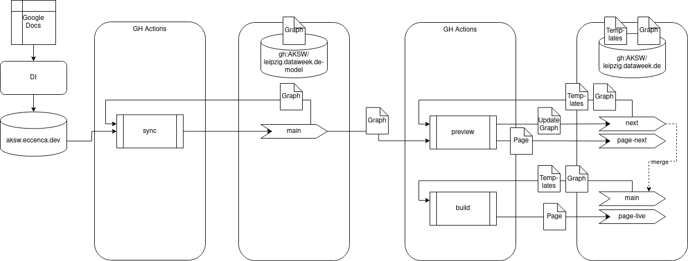

# Das ist die Seite der DataWeek in Leipzig

| URL     | Source Branch | Target Branch | Workflow | Description |
|---------|---------------|---------------|----------|-------------|
| https://dataweek.de/ | `main` | `page-live` | `build.yml` | Live |
| https://staging.dataweek.de/ | `develop` | `page-staging` | `preview-yml` | Staging/development preview for the Live page  |
| https://next.dataweek.de/ | `next` | `page-next` | New Layout development area |
| https://2022.dataweek.de/ | `past/2022` | `page-2022` | Archived page from 2022 |
| | `feature/newLayout` | | Static branch of the new layout |

A *source branch* is built with an actions workflow and the result is pushed to the respective *target branch*.

The setup of the build workflow is as follows:



## Local setup

### Requirements

- Git
- [Task](https://taskfile.dev/)
- Node.js & NPM
- Docker or Podman
- Python

### Preparation

Install the JavaScript dependencies
```
task install_javascript_dependencies
bundle install
```

### Build the styles

```
task styles
```

### Build the page (locally)

Only German language version:
```
task build_de
```

Alternatively all language versions:

```
task build_de build_en
```

### Build the page (docker)

Only German language version:
```
task build_docker_de
```

Alternatively all language versions:

```
task build_docker_de build_docker_en
```

### Serve the page

```
task serve
```

### Get the data, build the styles and the page in one run

With a local cmemc setup:

```
CMEMC_LOCAL='cmemc -c aksw.eccenca.dev' task default serve
```

## TODO

For Persons we might distinguish in the description between:
- [https://schema.org/affiliation](https://schema.org/affiliation)
- [https://schema.org/jobTitle](https://schema.org/jobTitle)
- [https://d-nb.info/standards/elementset/gnd#biographicalOrHistoricalInformation](https://d-nb.info/standards/elementset/gnd#id-feb84240ebb4724e71ceb35c74b63b13) (Short Bio for Keynote Speakers)

## Trouble Shooting

Eventuell muss man noch `bundle add webrick` ausführen, falls ein Fehler mit webrick kommt.
